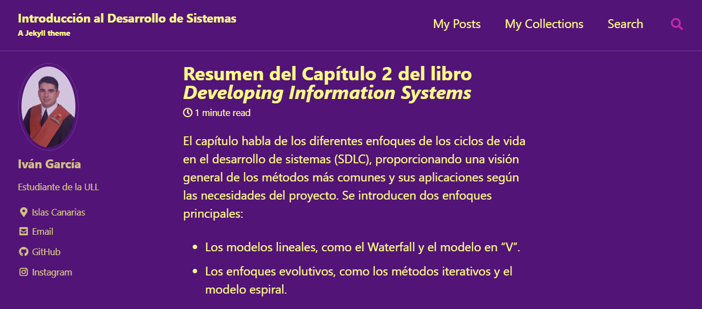
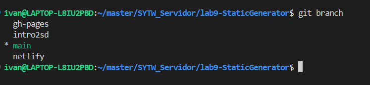
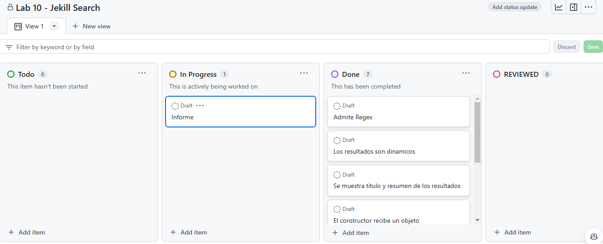

[](https://classroom.github.com/open-in-codespaces?assignment_repo_id=16675045)
> Iván García González

# Práctica 10 Jekyll search
## Sistemas y Tecnologia Web Servidor

### Admite expresiones regulares
Permite buscar por expresiones regulares.


### Los resultados vayan apareciendo conforme tecleamos
Se actualizan los resultados según se va escribiendo y aparece como parámetro en la URL.


### Se muestra una lista de enlaces a los ficheros que contienen la expresión buscada y un resumen de las primeros caracteres del fichero
Por cada búsqueda se muestra el título y un resumen de cada resultado.


### El constructor de JekyllSearch recibe en un objeto los argumentos en vez de posicionalmente
El constructor recibe un objeto con los argumentos.

```js
class JekyllSearch {
  constructor({ dataSource, searchField, resultsList, siteURL }) {
  }
}
```
A la hora de llamar al constructor, se llama de manera más explícita con los nombres de las propiedades en el objeto:

```js
const search = new JekyllSearch({
  dataSource: '{{site.baseurl}}/assets/src/search.json',
  searchField: '#search',
  resultsList: '#list',
  siteURL: '{{site.baseurl}}'
});
```

### Busca en todos los ficheros, no solo los de los posts sino también los de las páginas
Realizará la búsqueda en las páginas, además de en las colecciones y los posts considerados collections.

```json
  

  
  {
    "title": {{ page.title | jsonify }},
    "excerpt": {{ page.excerpt | markdownify | strip_html | jsonify }},
    "content": {{ page.content | markdownify | strip_html | jsonify }},
    "url": {{ site.baseurl | append: page.url | jsonify }}
  },
  
```
### Se ha hecho un resumen del capítulo 2 Lifecycle types and their rationales del libro *Developing Information Systems*, editado by James Cadle
Se realiza un resumen del capítulo 2 del libro en un post:


### Se ha creado una rama `intro2sd` para señalar el punto de entrega de la anterior y se hace la entrega de esta tarea en la rama `main`.
Se ha creado una rama `intro2sd` y la entrega de esta se hace en la `main`.


### Kanban Board project conteniendo las incidencias de la rúbrica
