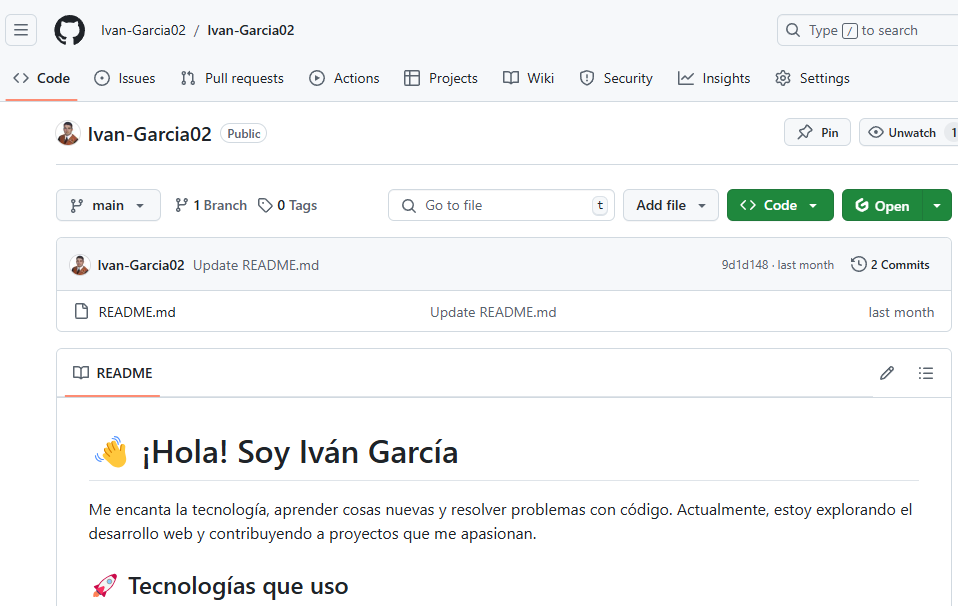

[](https://classroom.github.com/open-in-codespaces?assignment_repo_id=16675045)
> Iván García González

# Práctica 9 Introduction to Systems Development" and Static Generators
## Sistemas y Tecnologia Web Servidor

### Despliegue del sitio Web en GitHub pages usando Jekyll
Se ha realizado el despliegue del Sitio Web en GitHub pages, se puede consultar aqui: [Mi Página en Pages](https://ull-mii-sytws-2425.github.io/intro2sd-ivan-garcia-gonzalez-alu0101388786/)


### Resumen de los conceptos del capítulo
Se realiza un resumen del capitulo 1 del libro en un post:


### Kanban Board project conteniendo las incidencias de la rúbrica


### Despliegue en netlify o Vercel
Se ha realizado el despliegue del Sitio Web en Netlify, se puede consultar aqui: [Mi Página en Netlify](https://staticdeployivan.netlify.app/)


### Se ha creado una Jekyll Collection
Se ha creado una nueva colección sobre la lucha canaria en `_lucha_canaria`, con tres posts sobre la historia, reglas y figuras. Se ha realizado además las configuraciones necesarias en el `_config.yml`.


### Se ha hecho uso de liquid
En el post `Ejemplo de Uso de Liquid`, se muestra un ejemplo sencillo del uso de Liquid en Jekyll, incluyendo un bucle `for`, una estructura condicional `if-else`, y la asignación de variables.

```yml
items:
  - Ordenador
  - Teclado
  - Ratón
  - Monitor
  - Impresora
---

## Listado de Equipos (Uso de For)


- Equipo disponible: {{ item }}


<!--more-->

## Detalle Condicional de Equipos (Uso de For e If-Else)



**Nota**: La {{ item }} está en mantenimiento.

El {{ item }} está disponible para su uso.



## Total de Equipos


Actualmente, hay {{ total_items }} equipos listados.
```
### Se ha hecho uso de un .csv o .json en `_data`
En el post `Ejemplo de Uso de Datos`, se incorpora la informacion de un `.json` llamado `famosos` ubicado en la carpeta `_data` de Jekyll para acceder y mostrar información en un post de manera sencilla.

```md
<table>
  <thead>
    <tr>
      <th>Nombre</th>
      <th>Profesión</th>
      <th>Lugar de Nacimiento</th>
    </tr>
  </thead>
  <tbody>
    
    <tr>
      <td>{{ persona.nombre }}</td>
      <td>{{ persona.profesion }}</td>
      <td>{{ persona.lugar_nacimiento }}</td>
    </tr>
    
  </tbody>
</table>
```

### Reconfigurado los defaults del _config.yml
Se ha realizacio varias configuraciones en el fichero _config.tml:
Se ha cambiado el baseurl con el correpondiente de mi repositorio, el nombre de la página por mi nombre y foto, los links a las redes sociales, el footer y el tema de la página.

**Tema, BaseUrl y Name**


**Social**


**Author**


**Footer**


### Página 404 personalizada usando async JS y web services
Se ha personalizado la página 404, para que realize una llamada a una api que devuelve fotos de perros aleatoriamente


### Página personal en GitHub Pages


### Página personal en GitHub Pages enlazada desde el perfil GitHub del alumno
